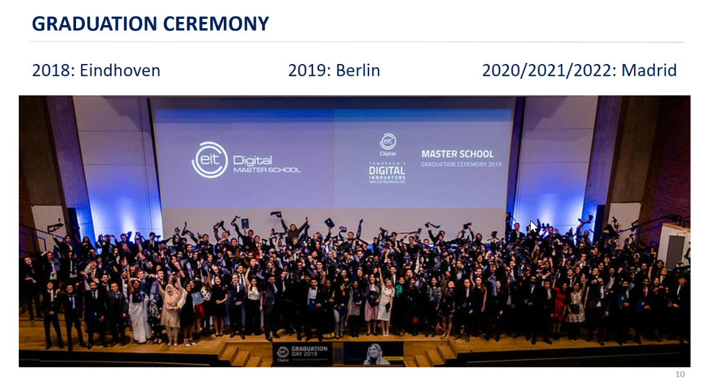

# Master
Universities
[[Master Aalto]]
[[Master Twente]]

## EIT
Courses pdf [link](https://masterschool.eitdigital.eu/fileadmin/2021/masterschool/EIT-Digital-Master-School-Data-Science-What-can-I-study-at-the-entry-and-exit-points.pdf)
Insurance [link](https://academy.eitdigital.eu/SITE/PRIVATE/GO/article.aspx?id=132): works 2 weeks before the beginning and 2 weeks after the studies

### Summer school
[link](https://summerschool.eitdigital.eu/admission-and-costs)
2 weeks of projects (they were mostly 11 days in 2022)
Period 2022: 4 Jul - 26 Aug
We receive information in January 2023

### Kick-off event
1. SiWeGO: Uber for shipping goods
app is ready, needs marketing to go to maket
2. Embneusys PC: iot for construction, mining defence
business analysis on how the sensors impact industry
3. Lovexair Foundation: developing and deploying health programs (love how they ballshit)
business analysis, lke impact for responsibility and sustainability
4. Athonet: 5G and LTE mobile platform for private networks for VR, industry 4.0
Analysis of customers segmentation of private network market
5. XPERT: wireless deplyed in large areas
analysis of metaverse and blue economy
6. Viimatech Digital Ltd: IoT solutions to monitor and optimize equipment with electrical motor, especially pumps, fans and compressors
feasibiliy for swimming pool segment
7. Schrott24 GmbH: B2B for scrap metal
analysis of european scrap metal users, create a map with it
8. **Getboarded Technologies**: Bulding tools that HR tech company should use
Undestand if HR woud use it
9. **Bosch**: authonomous driving
automated docking
10. Snowpack: linvisibility overlay network for hardware network security
market analysis
11. Getboarded Technologies: again….
12. Lumoin: deep renovation energy contracts
everthing, kind of application an target, where to get financing
13. Robotics Care AB: shower system for disabled
consumer perspective analysis
14. Edison: electricity and natural gas; smart mirror with screen camera and speaker
kind of content, is business profitable
15. Praim: somthing with hardware and software
centralized endpoint management capabilities according to the “as a Service” paradigm
16. BEIA: cloud communications and loT telemetry
something with 5g, not written what we have to do
17. MEEVA: VR for autism and adhd working with centers that adopt the technology
business model and pricing strategy
18. Xenia Reply: telemedicine platform
propose alternative business model, type of licence
19. LEO Satellites: still looking for mvp satellites
market analysis and feasibility

## Graduation cerimony

## Data
- 1/3 of the students get a job before graduating
- 70% salary above 40K euros/year, 14% makes 71K euros/year

## Change exit university
FAQ: Can I change or defer the study offer?
[faq](https://academy.eitdigital.eu/SITE/PRIVATE/GO/article.aspx?id=82)
[change of exit university page](https://academy.eitdigital.eu/SITE/PRIVATE/GO/article.aspx?id=137)

*Previous cohorts were offered a formal Change of Exit application in November (3 November to 16 November), with an historical average approval rate of 43%. There is no guarantee that this will be offered again. If this is a possibility to apply for a Change of Exit, we will let you know in due time; you do not need to contact the MSO about it.*

*Decisions will be communicated in mid-February.*

*The application will ask for the following:*
- *Your application ID*
- *The exit university to which you would like to change*
- *A statement explaining why you wish to change your assigned exit (300 words or less).*

- 89-31-28 KTH Royal Institute of Technology, Stockholm - 1 Year two
    
    Sweden
    
    975k inhabitants, Stockholm university 33k, KTH 13k
    
    Data scientist Sweden 55k - PIL pro capite $52k
    
    16% acceptance rate in 2021
    
    ### First year
    
    Look like interesting courses
    
    
    
    ### Second year
    
    Specialization in distributed systems and data mining for big data
    
    ![[Screenshot_2022-01-22-12-10-29-27_e2d5b3f32b79de1d45acd1fad96fbb0f.jpg]]
    
    ![[Screenshot_2022-01-22-12-10-41-04_e2d5b3f32b79de1d45acd1fad96fbb0f~2.jpg]]
    
- 125-50-58 Eindhoven University of Technology - 1 Year one + 3 Year two
    
    Netherlands
    
    In the middle of nothing, 231k inhabitants
    
    Data scientist paesi bassi 58k - PIL pro capite $52k
    
    ### First year
    
    Sounds a bit Formentini with that “process”, look at second year’s description.
    
    
    
    
    
    ### Second year
    
    Does not sound as interesting as KTH, sounds a little bit more abstract with Formentini at the beginning and cool technology not applicable anywhere in the middle.
    
    They focus on process instead of general data, for instance they have process mining instead of data mining. Should check if it's like Formentini.
    
    Exams are a bit general with only process mining going into depth.
    
    ![[Screenshot_2022-01-22-12-17-35-49_e2d5b3f32b79de1d45acd1fad96fbb0f.jpg]]
    
    ![[Screenshot_2022-01-22-12-17-41-32_e2d5b3f32b79de1d45acd1fad96fbb0f.jpg]]
    
- 112-116-110 Aalto University, Helsinki - 2 Year one
    
    Finland
    
    PIL pro capite 49k
    
    Data scientist Finland 54k
    
    650k inhabitants
    
    15% acceptance rate, from external website
    
    ### First year
    
    Not bad at all. Exams sound interesting but there is mandatory data mining that I may want to do the second year and supervised methods already seen.
    
    
    
    
    
    
    
    ### Second year
    
    Does not follow a path and has widespread courses. I'm afraid they repeat a lot of things and they don't go in details.
    
    ![[Screenshot_2022-01-22-12-43-45-72_e2d5b3f32b79de1d45acd1fad96fbb0f.jpg]]
    
    ![[Screenshot_2022-01-22-12-43-52-82_e2d5b3f32b79de1d45acd1fad96fbb0f.jpg]]
    
    ![[Screenshot_2022-01-22-12-44-00-12_e2d5b3f32b79de1d45acd1fad96fbb0f.jpg]]
    
- 189-126-96 University of Twente, Enshede - 2 Year two
    
    Netherlands
    
    Border with Germany, 150k inhabitants
    
    ### First year
    
    Names sounds theoretical, descriptions look practical
    
    
    
    ### Second year
    
    Sounds a bit more generic than Eindhoven but there is no Formentini and we need to specialize on some type of data.
    
    ![[Screenshot_2022-01-22-12-27-17-65_e2d5b3f32b79de1d45acd1fad96fbb0f.jpg]]
    
    ![[Screenshot_2022-01-22-12-27-24-17_e2d5b3f32b79de1d45acd1fad96fbb0f.jpg]]
    
- ~~295-? University of Turku - Y1 Y2 - 3 Year one~~
    
    Finland
    
    200k inhabitants
    
    ### First year
    
    Looks theoretical and not too bad.
    
    ![[Screenshot_2022-01-03-19-17-26-43_e2d5b3f32b79de1d45acd1fad96fbb0f.jpg]]
    
    ### ~~Second year~~
    
    No. Medical data science.
    
    ![[Screenshot_2022-01-22-12-57-25-44_e2d5b3f32b79de1d45acd1fad96fbb0f.jpg]]
    
    ![[Screenshot_2022-01-22-12-57-29-22_e2d5b3f32b79de1d45acd1fad96fbb0f.jpg]]
    
- ~~89-287 Université Paris-Saclay - Y1 Y2~~
    
    France
    
    ### First year
    
    ![[Screenshot_2022-01-22-13-08-11-04_e2d5b3f32b79de1d45acd1fad96fbb0f.jpg]]
    
    ### Second year
    
    
    
- ~~459-75 Universidad Politécnica de Madrid - Y1 Y2~~
    
    Technical University of Madrid (UPM)
    
    PIL pro capite 27k
    
    Data scientist salary 35k
    
    ### First year
    
    Too little machine learning, cognitive systems sounds too sociological
    
    Website looks trash
    
    ![[Screenshot_2022-01-03-19-04-56-87_e2d5b3f32b79de1d45acd1fad96fbb0f.jpg]]
    
    ### Second year
    
    ![[Screenshot_2022-01-22-13-00-15-10_e2d5b3f32b79de1d45acd1fad96fbb0f.jpg]]
    

~~20-142 Politecnico di Milano - Only entry point~~

~~440-247 Università di Trento~~

~~701-? Université Côte d’Azur, Nice~~

~~801-451 University of Rennes 1, Rennes~~

~~651-? Eötvös Loránd University, Budapest~~

## Participation distribution

Year 1, Aalto: ++++++++++++++++
Year 2, Aalto: +++++++++++++++++

Year 1, NL: +++++++++++++++++
Year 2, NL: ++++++

Year 1, KTH: ++++++++++++++++
Year 2, KTH: +++++++++++++++++++++++++++

Twente vs Eindhoven: *Living is an important factor and that is here i found Uni Twente to be best. They are the only university in NED to provide on campus housing facility in a massive massive scale. I lived on campus in Enschede at Uni Twente and a had an amazing experience. Eindhoven is a very dry and kind of ugly place to live. Without a proper housing facility for students it can get difficult to socialize and make new friends.*

## Universities comparison

Expenditure by student in tertiary education in euros ([link](https://ec.europa.eu/eurostat/databrowser/view/EDUC_UOE_FINI04__custom_2067655/default/map?lang=en))

Expenditure by student in tertiary education in euros ([link](https://ec.europa.eu/eurostat/databrowser/view/EDUC_UOE_FINI04__custom_2067655/default/bar?lang=en))

GDP per capita PPP ([link](https://data.worldbank.org/indicator/NY.GDP.PCAP.PP.CD?end=2021&locations=SE-CH-NO-FI-NL-IT-DE&start=1990))

## Other universities

Ranked by: [link](https://www.topuniversities.com/university-rankings/university-subject-rankings/2020/engineering-technology)

- 29 - TUM Technische Universität München: Data Engineering and Analytics
    
    Deadline 31/05
    
    There is no machine learning, only data course [link](https://www.in.tum.de/en/current-students/masters-programs/data-engineering-and-analytics/curriculum.html)
    
    Requirement: scientific essay [link](https://www.in.tum.de/en/for-prospective-students/apply-for-admission/masters-programs/data-engineering-and-analytics/)
    
    Acceptance rate: 8%
    
- 51 - Rwth Aachen: Data Science
    
    Open to everyone, even to international students
    
    15th July
    
- 173 - LMU Ludwig Maximilian University of Munich: Data Science
    
    [link](https://www.m-datascience.mathematik-informatik-statistik.uni-muenchen.de/index.html)
    
    Website is horrible but universtiy should be very good
    
    Deadline not found, applications opening 20 April
    
    Application should be here somewhere [link](https://efv-datascience.ifi.lmu.de/)
    
    Requirement: 1000 words essay
    
- 221 - Utrecht University
    
    Courses ([link](https://www.uu.nl/masters/en/artificial-intelligence/courses)) there are very little mandatory courses
    
    Deadlines: 1 June
    
    Fees: 100 euros
    
- 600 - Bolzano
    
    [link](https://www.unibz.it/en/faculties/computer-science/master-computational-data-science/)
    
    Computational Data Science
    
    Application deadline: 07/07/2022 (by noon local time)
    
- Innsbruck
    
    Deadline 31 Ottobre https://www.uibk.ac.at/studium/organisation/studium/index.html.en#dates
    
- Luxembourg
- ~~4 - ETH (Bozzo)~~
    
    Deadline: 30th April
    
    Fees: CHF 150
    
- ~~11 - EPFL Lausanne: Data Science~~
    
    Be aware that **admission is competitive**. Only candidates with excellent academic records and references have good chances of being accepted.
    
    Deadline: 15th April
    
    Fees: CHF 150
    
- ~~30 - KTH Royal Institute of Technology: Machine Learning (Bozzo)~~
    
    Deadline for all documents 1st February
    
- ~~68 - KIT Karlsruhe Institute of Technology~~
    
    Are they even a university?
    
- ~~79 - Univestity of Copenhagen: Social Data Science~~
    
    It’s social
    
- ~~121 - Technische Universität Dresden: Data Science~~
    
    Tought in german
    
- ~~142 - Aalto~~
    
    Application closed in January [link](https://www.aalto.fi/en/study-options?degreeType=masters&search=data)
    
- ~~260 - Heidelberg University Germany: Data and Computer Science~~
    
    Courses not found in english
    
- ~~255 - University of Helsinki (Bozzo)~~
    
    Deadline in January
    
- ~~? - University of Monaco: DS not found (Bozzo)~~
    
    

To check:

- University of Magdeburg
- TU Dortmund
- University of Mannheim
- University of Hildesheim
- University of Applied Sciences Darmstadt
- Leuphana University of Luneburg
- University of Gottingen
- Frankfurt School of Finance and Management

## UniTrento abroad

Unitn website ([https://international.unitn.it/outgoing/open-selection-calls](https://international.unitn.it/outgoing/open-selection-calls))

**Double degree (year abroad)**

- DISI has only 2 options in Computer science and they are not interesting, they both require to be enorolled in the second year of the master degree when leaving
- Deadline is in January, mobility from August

**BIlateral agreements (semester abroad)**

- C1 by cla is required everywhere, some require additional certification like toefl, ielts

Admission criteria *Erasmus?*

- 70% Video motivazionale, progetto di studi all’estero ed eventuale colloquio
- 30% Media ponderata dei voti registrati in carriera entro il 31 ottobre 2021 o voto del titolo di studio del ciclo precedente

Scolarship

- ISEE must be sent before the application deadline

734042419826

17 students: 4 First year, 13 Exit year